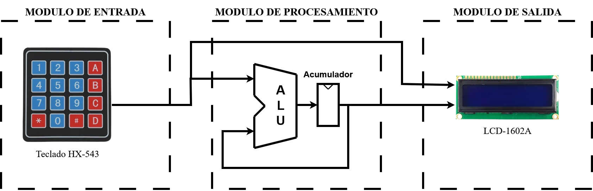

# ALU_VHDL

Design and implementation of a 16-bit Arithmetic Logic Unit (ALU) on a Terasic DE0-Nano SoC FPGA using VHDL.

This repository contains the complete source code, Quartus project files, documentation, and supporting material associated with the paper:

> **"Diseño e Implementación de una Unidad Aritmético-Lógica en una placa de desarrollo FPGA"**

---

## Project Objectives

The primary objective of this project is to demonstrate the implementation of a simple Arithmetic Logic Unit (ALU) on an FPGA using VHDL, providing an introductory educational example for students interested in Hardware Description Languages (HDLs) and digital system design.

---

## Hardware

- Terasic DE0-Nano SoC Development Board
- Intel (Altera) Cyclone V FPGA (5CSEMA4U23C6)
- 4×4 Matrix Keypad
- 16×2 LCD Display (HD44780 Compatible)
- 10 kΩ Potentiometer (LCD Contrast)

---

## Software

- Intel Quartus Prime Lite 25.1
- VHDL

---

## Repository Contents

- `VHDL_code/` contains the modified source code used in this work.
- `LCD_library/` contains the original LCD library developed by Jesús Eduardo Méndez Rosales.
- `configs/` contains the Quartus project configuration and pin assignments.

---

### Documentation

Contains the complete paper describing:

- System Design
- Hardware Implementation
- FPGA Configuration
- Experimental Results

---

### External_Library

Contains the original LCD library developed by **Jesús Eduardo Méndez Rosales**, distributed under the GNU GPL v3 license.

Original project:

https://intesc.mx/libreria-lcd/

---

## Project Setup

1. Create a new project in **Intel Quartus Prime Lite 25.1**.
2. Select the target device:
   **Intel (Altera) Cyclone V 5CSEMA4U23C6**
3. Add all VHDL source files contained in the `VHDL_code` directory to the project.
4. Set `main.vhd` as the **Top-Level Entity**.
5. Run **Analysis & Synthesis**.
6. Import or recreate the pin assignments using the files available in the `configs` directory or according to the paper.
7. Verify that all I/O pins use the **3.3-V LVTTL** I/O standard.
8. Compile the complete project (**Start Compilation**).
9. Program the FPGA using the generated `.sof` file.
10. Connect the keypad, LCD and potentiometer according to the paper.

---

## License

The original LCD library is distributed under the GNU GPL v3 license.

All original code developed for this project is released under the MIT License unless otherwise stated.

---

## Citation

If this repository contributes to your work, please consider citing it using the information provided in the `CITATION.cff` file.
